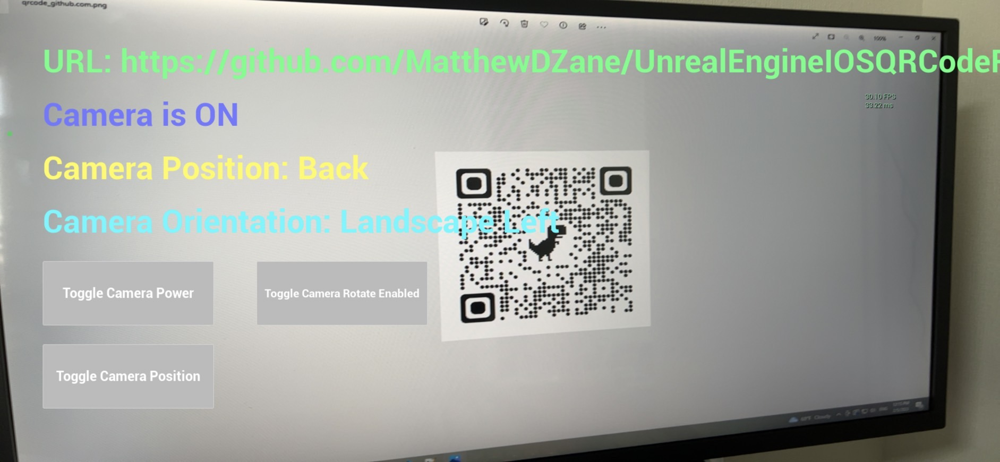
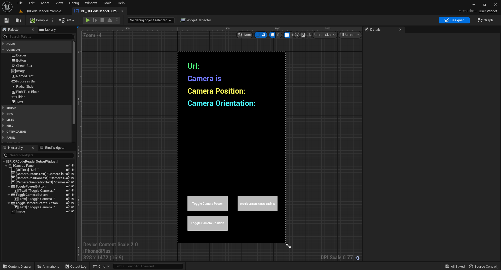
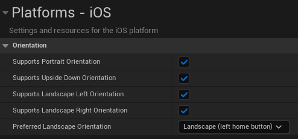

<!-- PROJECT LOGO -->

  

  <h3 align="center">Unreal Engine iOS QR Code Reader Plugin</h3>

  

    An Unreal Engine plugin for QR Code Reading in iOS!
  

<!-- TABLE OF CONTENTS -->

  
Table of Contents

  <ol>
    <li>
      <a href="#about-the-project">About The Project</a>
    </li>
    <li>
      <a href="#getting-started">Getting Started</a>
      <ul>
        <li><a href="#prerequisites">Prerequisites</a></li>
        <li><a href="#installation">Installation</a></li>
      </ul>
    </li>
    <li><a href="#usage">Usage</a></li>
    <li><a href="#license">License</a></li>
    <li><a href="#contact">Contact</a></li>
    <li><a href="#acknowledgments">Acknowledgments</a></li>
  </ol>

<!-- ABOUT THE PROJECT -->
## About The Project

  

This is an example project template for the IOSQRCodeReader Unreal Engine plugin. Access can be purchased from the [Epic Games Store](https://www.unrealengine.com/marketplace/en-US/store) or if you have access to the source repository the latest commit can be pulled from this [github repository](https://github.com/MatthewDZane/UnrealEngineIOSQRCodeReader). Setup instructions are included below.

Please contact [matthewdzane@gmail.com](matthewdzane@gmail.com) for requests for additional functionality and for access to the [github repository](https://github.com/MatthewDZane/UnrealEngineIOSQRCodeReader).

(<a href="#readme-top">back to top</a>)

<!-- GETTING STARTED -->
## Getting Started

To get a local copy up and running follow these simple steps.

### Prerequisites

Please read the official Unreal Engine documentation for 
[iOS Game Development](https://docs.unrealengine.com/4.27/en-US/SharingAndReleasing/Mobile/iOS/)
to ensure you meet the prerequisites for developing for iOS Unreal Engine applications.

It is recommended to use a MacOS device to setup and build the project. It is possible to use a Win64 machine, but remote access to a MacOS machine will still be needed. An iOS device is required to build the project, otherwise most of the functionality will not work.

### Installation

_Below are instructions on how to setup the Unreal Engine IOS QR Code Reader plugin._

1. Ensure that Unreal Engine 5.1 is installed.
2. Copy the IOSQRCodeReader plugin into the "Plugins" folder.
3. In a Finder, right click the .uproject file and Generate XCode Project files. 
4. Open the project in XCode and build it.
5. Open the project in Unreal Engine 5.
6. Now the example project is ready to build onto an iOS device.

Note: Make sure you have read and met the 
[iOS Game Development](https://docs.unrealengine.com/4.27/en-US/SharingAndReleasing/Mobile/iOS/)
prerequisites. You will have to setup your own BundleIdentifier in the Example 
Project and your Apple Developer Account. More detailed info is in the official
documentation.

(<a href="#readme-top">back to top</a>)

<!-- USAGE EXAMPLES -->
## Usage

  

This Example Project's default map is the IOSQRCodeReader plugin's 
QRCodeReaderExampleMap, which adds the BP_QRCodeReaderOutputWidget to the
player viewport. The widgets spawns a QRCodeReaderActor and displays the
following data:
- Scanned QR Code Url
- Camera On Status
- Camera Position (Front or Back)
- Camera Orientation (Left, Right, Portrait, or Portrait Upside Down)
- Camera Feed Texture

The BP_QRCodeReaderOutputWidget also includes three buttons widget toggle:
- Camera On Status
- Camera Position
- Camera Auto Rotate Enabled Status

The project Platform -> iOS -> Orientation settings are all checked. This may need to be modified to meet your specific needs.

  

(<a href="#readme-top">back to top</a>)

<!-- LICENSE -->
## License

Please read the license [here](https://github.com/MatthewDZane/UnrealEngineIOSQRCodeReader/license.md).

(<a href="#readme-top">back to top</a>)

<!-- CONTACT -->
## Contact

If you have any questions, issues, or requests, please contact me via my
LinkedIn or the email below.

Matthew Zane 
- [![LinkedIn][linkedin-shield]][linkedin-url]  [@matthewdzane](https://www.linkedin.com/in/matthewdzane/) 
- matthewzane.unrealengine@gmail.com

Project Link: [https://github.com/MatthewDZane/UnrealEngineIOSQRCodeReaderExampleProject/](https://github.com/MatthewDZane/UnrealEngineIOSQRCodeReaderExampleProject/)

Plugin Project Link: [https://github.com/MatthewDZane/UnrealEngineIOSQRCodeReader/](https://github.com/MatthewDZane/UnrealEngineIOSQRCodeReader/)

(<a href="#readme-top">back to top</a>)

<!-- ACKNOWLEDGMENTS -->
## Acknowledgments

Thank you to [NSYNK {](https://nsynk.de/) for sponsoring this project!

(<a href="#readme-top">back to top</a>)

<!-- MARKDOWN LINKS & IMAGES -->
<!-- https://www.markdownguide.org/basic-syntax/#reference-style-links -->
[contributors-shield]: https://img.shields.io/github/contributors/MatthewDZane/UnrealEngineIOSQRCodeReaderExampleProjectPreview.svg?style=for-the-badge
[contributors-url]: https://github.com/MatthewDZane/UnrealEngineIOSQRCodeReaderExampleProject/graphs/contributors
[forks-shield]: https://img.shields.io/github/forks/MatthewDZane/UnrealEngineIOSQRCodeReaderExampleProjectPreview.svg?style=for-the-badge
[forks-url]: https://github.com/MatthewDZane/UnrealEngineIOSQRCodeReaderExampleProject/network/members
[stars-shield]: https://img.shields.io/github/stars/MatthewDZane/UnrealEngineIOSQRCodeReaderExampleProjectPreview.svg?style=for-the-badge
[stars-url]: https://github.com/MatthewDZane/UnrealEngineIOSQRCodeReaderExampleProject/stargazers
[issues-shield]: https://img.shields.io/github/issues/MatthewDZane/UnrealEngineIOSQRCodeReaderExampleProjectPreview.svg?style=for-the-badge
[issues-url]: https://github.com/MatthewDZane/UnrealEngineIOSQRCodeReaderExampleProject/issues
[linkedin-shield]: https://img.shields.io/badge/-LinkedIn-black.svg?style=for-the-badge&logo=linkedin&colorB=555
[linkedin-url]: https://linkedin.com/in/matthewdzane